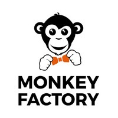

# Monkey factory integration web

Intégration web d'une maquette en HTML / CSS avec configuration GULP
La page web est responsiv ainsi que fonctionnel sur mobile

## Pour Monkey Factory

| Rôle                   | Nom                    | Email                            | 
|------------------------|------------------------|----------------------------------|
| Dev.Front, Intégrateur | **Dolmazon Dylan**     | dylan.dolmazon@etu.univ-lyon1.fr |

## Installation du projet

- `cloner le dossier`
- `cd integration web` 
- `npm i`
- `npm i gulp`

## Vous pouvez utiliser les commandes:
- `gulp watch` pour minifier à chaque sauvegarde les fichiers `.js , .css , img`  du dossier `src` vers le dossier `dist`
- `gulp default` pour minifier une fois les fichiers `.js , .css , img`  du dossier `src` vers le dossier `dist`

## Modification du projet

- Pour modifier le projet vous devez modifier les fichiers du dossier `src/*`